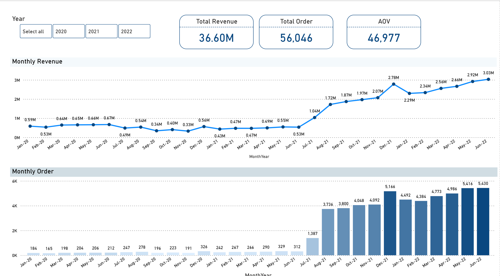
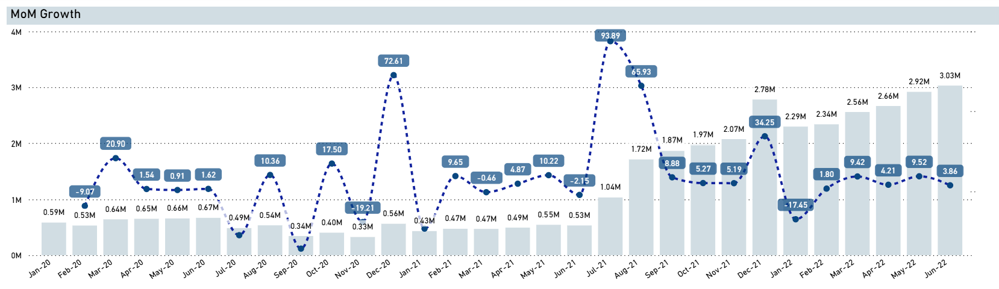
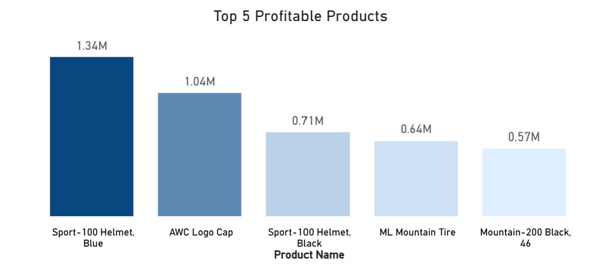
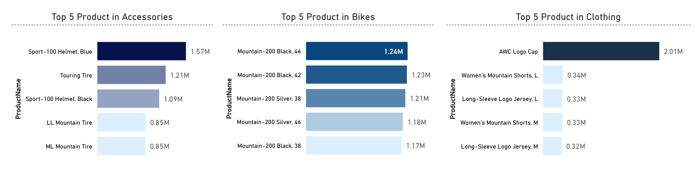

# Sales & Customer Performance Analysis (AdventureWorks)

## Business Context
This Power BI report visualizes sales performance using AdventureWorks data that has been pre-processed and aggregated with SQL.
The goal of this report is to present clear, decision-oriented insights that help stakeholders understand overall performance, key product drivers, and revenue growth trends over time.
The analysis focuses on translating SQL outputs into visuals that support business interpretation rather than exploratory analysis.

## Key Questions
This report is made to answer the following business questions:

1. How is overall sales performance evolving over time?
2. What are the key revenue and order volume trends?
3. Which products perform best within each category?
4. How does revenue grow month-over-month, and are there signs of increment or decrement over periode?
   
## Analytical Approach
- Sales data was aggregated and modeled using PostgreSQL (see /sql folder)
- Core metrics such as total revenue, total orders, and Average Order Value (AOV) were calculated at the appropriate grain in SQL.
- Time based analysis was performed using monthly aggregation and month-over-month growth logic.
- Power BI was used exclusively for visualization, filtering, and business interpretation, not for metric recalculation.
  
## Key Insights
### 1. Revenue & Order Trend Dynamics

Across 2020–2022, revenue and order trends mostly move in the same direction, indicating sustained demand growth. Periods where revenue and order volumes diverge suggest changes in Average Order Value (AOV), likely driven by shifts in pricing, product mix, or customer purchasing behavior.

- **2020** performance was relatively volatile, with noticeable revenue–order divergence, reflecting AOV fluctuations and a gradual recovery toward year-end.
- **2021** the business experienced strong and sustained growth, with revenue and orders increasing in tandem and peaking sharply in December, indicating healthy demand expansion.
- **2022** growth patterns remained consistent with the previous year but became more stabilized, with moderated increases suggesting a maturing sales trend.
  
### 2. Growth Peaks & Seasonality
The most significant revenue and order peaks occurred in:
- **June 2022** (Revenue: 3.03M, Orders: 5,430)
- **December 2021** (Revenue: 2.79M, Orders: 5,166)
These peaks indicate strong mid-year and year-end seasonality, likely influenced by promotional cycles or purchasing behavior patterns.

### 3. MoM Growth

The most significant MoM revenue growth occured in:
- **December 2020** (+72.61%)
- **July 2021** (+93.83%)
These extensive growth indicate strong mid-year and year-end seasonality, likely influenced by promotional cycles or purchasing behavior patterns.
Further validation of MoM growth drivers (order volume vs AOV, category-level contribution, and product concentration) can be performed using the existing monthly KPI and product-level queries in this project.

### 4. Top Profitable Products

Profit analysis reveals that a small number of products contribute disproportionately to total profitability:

- **Sport-100 Helmet, Blue** leads with **1.34M** in total profit, making it the most profitable product overall.
- **AWC Logo Cap** follows with **1.04M**, demonstrating strong margin performance despite its lower price point.
- **Sport-100 Helmet, Black**, **ML Mountain Tire**, and **Mountain-200 Black, 46** complete the top five, each generating between **0.57M–0.71M** in profit.

This pattern indicates that profitability is driven not only by high-priced items (e.g., Bikes) but also by high-margin accessories and apparel. 
From a business perspective, these products represent strong candidates for continued promotion, inventory prioritization, and margin-protection strategies.

### 5. Product Performance by Category

Revenue within each category is highly concentrated in a small number of top-performing products:

- **Accessories**: Revenue is dominated by helmets and tires, with the *Sport-100 Helmet (Blue)* emerging as the top contributor, generating **1.57M** in revenue.
- **Bikes**: The top 5 products are largely driven by the *Mountain-200 Series*, with the *Black, 46 variant* leading at **1.24M**, indicating strong customer preference for this model line.
- **Clothing**: Revenue is heavily concentrated in the *AWC Logo Cap*, which generated **2.01M**, making it the highest revenue item within the category.

This concentration suggests that a limited set of SKUs drives the majority of category-level revenue. To support future growth, the business should review underperforming products for repositioning, bundling, or rationalization, while reinforcing availability and promotion of high-impact products.

## Tools Used
- PostgreSQL — data aggregation and analytical logic
- Power BI — data visualization and business reporting
